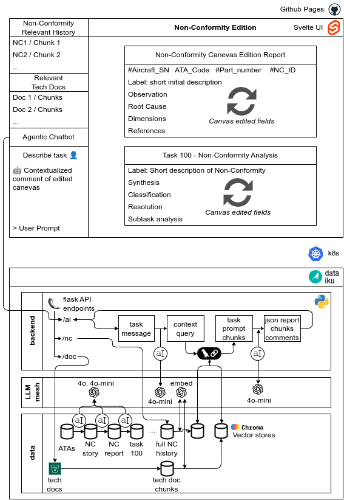

# Non conformities canevas edition based on Agentic Rag using Dataiku & Svelte.js

## Global Architecture

Global components used :

- [Svelte for UI](https://svelte.dev) - [this repo](https://nc.genai-cgi.com)
    - Non-Confromity Canevas Creation (interactive creation with AI)
    - Contextual information retrieved with RAG (Non-Conformity history, Tech Docs)
    - [Deep-Chat](https://deepchat.dev) for backend-less Chatbot


- [Dataiku](https://dataiku.com) for [AI Agent and dataprep ](https://github.com/rhanka/nc-dataiku)
    - Flask Backend with Agents specialized by task
    - Vector Databases (Chroma DB) for Non Conformity history and Tech docs
    - Tech Doc storage, parsing, chunking and embedding
    - Synthetic data creation for Non-Confomity history (5000 tickets with at least five steps)
    - LLM Mesh for OpenAI embeddings and GPT4o/4o-mini, can be replaced by any-LLM with few clicks

The Agent AI works as follows:

- User provide limited input either on a Non-Conformity task field or directly to the deep-chat input.
- AI Agent looks up to vector databases and provide a json including task fields to update the Non-conformity Edition block (Report or Task 100), reference tech docs and non-conformity tickets (to update left side helpers), and a comment to display within deep-chat
- User can iterate to make the Non-Conformity task fiels more relevant or to translate it to a more comfortable language.



## Developing
```bash
# install dependencies (legacy option required to use svelte-pdf)
npm install --legacy-peer-deps

# dev mode
npm run dev
```

## Building

To create a production version of your app:

```bash
npm run build
```

You can preview the production build with `npm run preview`.

## Deploy

This repo is using Github Actions to deploy static pages to Github Pages (cf .github/workflows/deploy.yml)